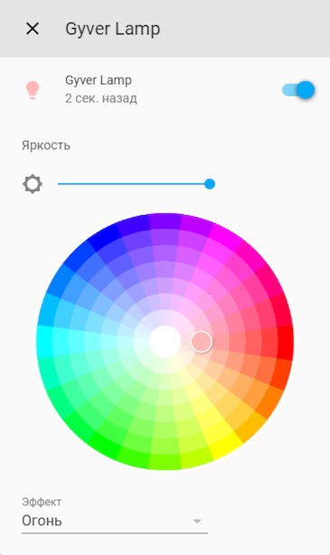

# Gyver Lamp

Компонент интеграции [Home Assistant][1] с [Огненной Wi-Fi Лампой][2] замечательного российского изобретателя [Александра Майорова][3]. Обязательно **не забывам поддержать** автора этого изобретения.

[1]: https://www.home-assistant.io/
[2]: https://alexgyver.ru/gyverlamp/
[3]: https://alexgyver.ru/about_gyver/

Компонент работает со стандартной прошивкой лампы. Текущее состояние лампы **опрашивается раз в 30 секунд**, поэтому, после старта Home Assistant, она будет пол минуты выключена.

Поддерживается:

- включение/выключение лампы
- установка яркости
- установка эффекта из списка
- установка скорости и масштаба через тон и насыщенность (круг с набором цветов в интерфейсе HA)
   - **насыщенность** это **скорость**, ближе к центру - быстрее 
   - **цвет** это **масштаб**, но в некоторых эффектах цвет это цвет :) 



## Установка

Копируем папку `gyverlamp` в папку `custom_components` в папку конфигов Home 
Assistant. Например:

`~/.homeassistant/custom_components/gyverlamp/...`

## Настройка

[](https://www.youtube.com/watch?v=riYsv5k_EdY)

Поддерживается как настройка из GUI, через добавление интеграции. Так и настройка в `configuration.yaml`:

```yaml
light gyverlamp:
- platform: gyverlamp
  host: 192.168.1.123
  name: Лампа Гайвера
  effects:
  - Конфетти
  - Огонь
  - ...
```